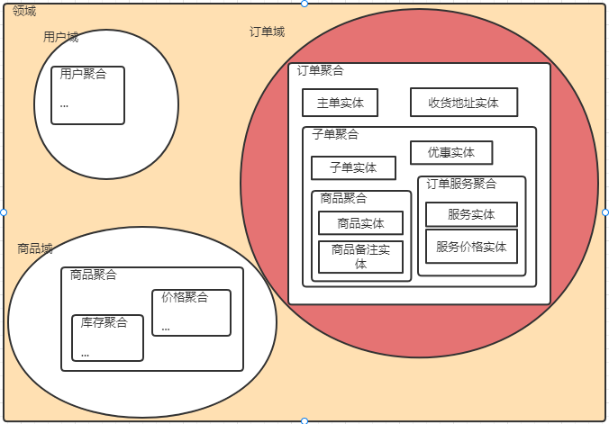
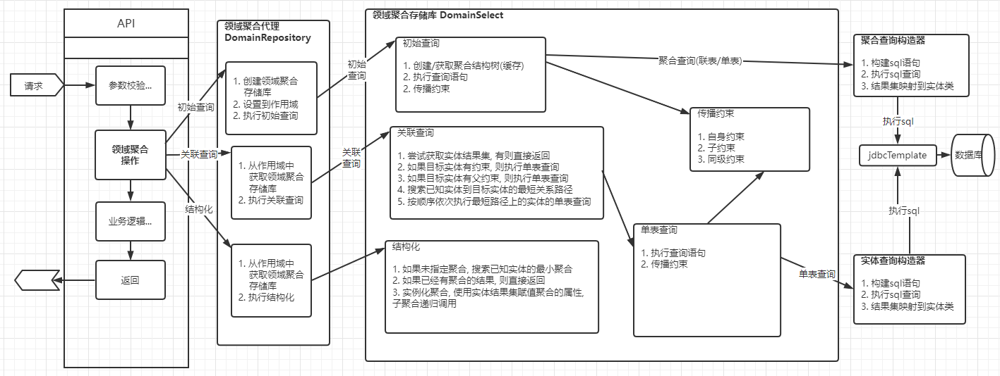
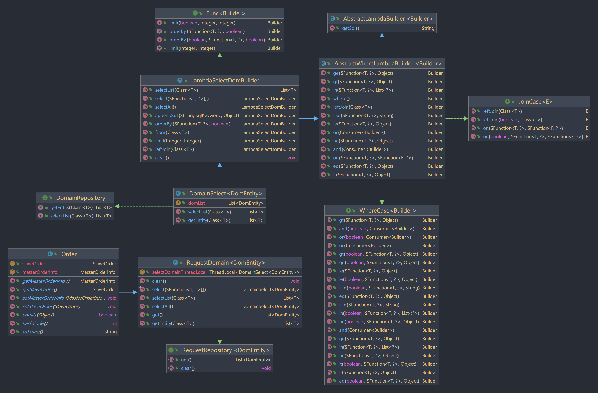
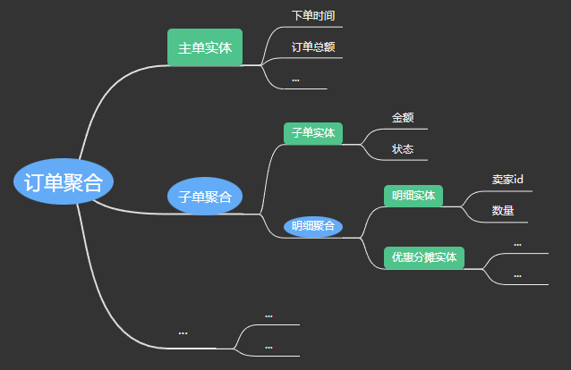

# 领域持久化  


## 背景

**领域驱动设计是指导复杂软件系统设计的方法论, 帮助我们构建逻辑清晰, 易维护的软件**

> * 按照**领域驱动设计**将复杂系统拆分成多个领域, 领域内高内聚, 领域间低耦合, 每个领域对应一个微服务, 具有架构清晰, 独立开发部署更灵活, 复用性更强等优点  
> * 领域内**实体对象**高度内聚, 关联性较强, 一个领域中的模型可由一个或多个**领域聚合**构成, 领域聚合将领域内实体对象联系在一起 (将一盘散沙凝聚成一座山丘)  
> * 现实世界/业务中, 多数情况操作的是由**多个实体对象随机组合**而成的聚合而不仅仅是单个实体, "召集"互相关联的不同实体和维护实体之间的关系是繁琐的重复劳动  



## 是什么

**领域持久化是: 面向领域模型的持久化框架, 为开发者自定义的领域聚合(表实体结构化组合而成的一个整体)注入自动内部关联的能力, 一切查询/关联/更新/组合/结果映射都是在操作领域聚合, 并最终反应到不同实体上.**
**将关系型数据库当作文档型数据库使用, 保留了关系型数据库的按表分类存储的特性和优势之外, 又可以像文档型数据库那样自然**

> * 支持的操作有: 
> * 检索  
>     * 领域聚合查询可以是**单表查询**, 也可以是**联表查询**(用于复杂的多表条件分页排序查询), 应对不同场景  
>     * 聚合内实体自动程序**关联查询**, 减轻数据库压力, 减小锁颗粒度, 减少开发者重复劳动  
>     * 检索的实体对象可以**动态的自由组合**, 按需获取 
> * 结果  
>     * **聚合的结果**更符合现实世界的结构和逻辑  
>     * 同时提供按实体分类的**集合的结果**, 应对不同场景  
> * 保存  
>     * 自动**级联保存**(新增或更新) 
> * 其它特性:  
>     * 充血模型, 减少存储库(repository)概念, 领域模型本身就是存储库  
>     * 自由嵌套聚合, 多层次的子聚合可以单独使用  

## 为什么

**现状: 面向表结构的编程有以下痛点:**

> * 联表查询效率低下(数据库瓶颈, 无法复用, 缓存未命中等缺点)
> * 单表查询+代码关联又繁琐(需要将上一个查询结果做为条件进行下一个查询, 且需要分组映射, 使两个查询结果对应起来)
> * 不同场景使用到领域不同信息或使用方式略有差别, 每次业务稍有变化就得专门写一个查询方法
> * 不是面向领域模型的编程, 增加理解难度和开发难度(因为这不符合现实世界的结构和逻辑)

## 使用

**以订单聚合查询为例, 详情参考测试用例**

1. 依赖注入领域聚合对象(Order为订单聚合)  
   ```
    @Autowired
    Order order;
   ```
2. 构造领域聚合初始查询语句(MasterOrderInfo为主单实体)
   ```
   //订单聚合初始查询-主单实体
   order.selectAll().from(MasterOrderInfo.class).where().in(MasterOrderInfo::getId, masterOrderIds).selectList(Order.class);  
   ```    
3. 获取领域实体对象信息(SlaveOrderInfo为子单实体)  
    ```
    //关联查询子单实体
    order.getEntity(SlaveOrderInfo.class);
    ```


## 设计思路

### 分析需求

**希望能根据一个[查询条件]查询出领域内[所有想要的实体]信息, 并能自动级联保存领域聚合**

* 查询条件:
    * 要支持单表查询
    * 也支持联表查询
    * 要支持复杂查询条件(=, in, >, not null)
* 所有实体信息:
    * 不想要的信息不要查询(减少无用功)
    * 只有在真正需要用到实体时才执行查询(懒加载)
    * 未指明联表的就不要联表, 而是代码关联
* 查询结果要提供两种形式, 以满足不同使用场景:
    * 聚合集合
    * 按实体分类的集合
* 级联保存领域聚合:
  * 顾名思义, 没什么好解释的

### 架构设计



* 定义**领域聚合**
    * 领域聚合要可复用, 可自由组合使用, 可单独使用, 不限层级的多级嵌套
    * 领域聚合作为数据信息载体, 应尽可能单纯, 只有数据信息属性, 不应有额外的属性
* 定义**领域聚合存储库**
    * 领域聚合存储库负责管理领域聚合内实体对象的约束条件及索引
    * 约束是指领域聚合内实体关联关系, 同一层级的聚合应该有同一个约束, 不同层级应该有代表实体间接约束
    * 索引是处理一对多关系时用来定位的
    * 从聚合根到子聚合是树形结构, 所以将多对多关系和多对一关系转化成一对多关系减少复杂度
    * 领域聚合存储库负责维护领域聚合内属性和表的关系, 父聚合和子聚合的联系, 聚合结果等信息
* 定义**领域聚合代理**
    * 领域聚合代理充当领域聚合和存储库之间的桥梁 (由于之前说领域聚合作为数据载体应尽可能单纯, 所以领域聚合和存储库应当是组合关系而不是继承关系)
    * 代理和被代理通常是组合关系, 但这里为了实现更简单的api, 改为继承关系(领域聚合继承领域聚合代理)
    * 负责管理领域聚合的作用域(singleton单例(默认)/property原型/request请求级/thread线程级...)
* 定义**领域聚合查询构造器**
    * 支持自由选择领域聚合内任意一个实体单表查询或任意多个实体联表查询
    * 支持复杂查询条件
    * 负责将结果集映射到领域聚合内
* 简化主流程(查询):
  1. 初始化查询:
     1. 查询聚合的结构树(缓存)
     2. 给定条件, 执行sql查询以得到某些实体  
     3. 对聚合中所有实体产生约束(直接或间接)
  2. 关联查询:  
     1. 如果-目标实体已经被约束
        1. 按约束构造条件, 执行sql查询
        2. 对聚合中所有实体产生约束(直接或间接)
     2. 如果-目标实体未被约束
        1. 查找已知实体到目标实体的最短关联路径
        2. 依次执行路径上实体的关联查询
     3. 返回实体集合(缓存)
  3. 获取聚合结果
     1. 如果-未指定聚合
        1. 查找已知实体最小子聚合
     2. 实体集合按关联字段分组赋值到聚合的属性中
     3. 返回子聚合结果(缓存)


### 关键类图


## 效果

**以订单聚合查询举例**

**领域聚合定义**  

```java
@Dom
@Data
public class Order extends RequestDomain<Order> {

    /**
     * 主单实体
     */
    @JoinOn(joinId = "id")
    public MasterOrderInfo masterOrderInfo;

    /**
     * 子单聚合
     */
    @JoinOn(joinId = "slaveOrderInfo.masterOrderId")
    public SlaveOrder slaveOrder;
}
```

**使用领域持久化**
```java
@Service
public class GetOrderApi {

    @Autowired
    Order order;

    public List<Order> getOrder(List<Long> masterOrderIds){

        //订单聚合初始查询-主单实体
        order.selectAll().from(MasterOrderInfo.class).where().in(MasterOrderInfo::getId, masterOrderIds).selectList(Order.class);

        //关联查询子单实体
        order.getEntity(SlaveOrderInfo.class);

        //返回聚合结果
        return order.get();
    }
}
```

**未使用领域持久化**
```java
@Service
public class GetOrderApi2 {

    @Autowired
    MasterOrderInfoRepository masterOrderInfoRepository;

    @Autowired
    SlaveOrderInfoRepository slaveOrderInfoRepository;

    public List<Order> getOrder(List<Long> masterOrderIds){

        //查询主单实体
        List<MasterOrderInfo> masterOrderInfos = masterOrderInfoRepository.getByIds(masterOrderIds);

        //关联查询子单实体
        List<SlaveOrderInfo> slaveOrderInfos = slaveOrderInfoRepository.getByMasterOrderInfoIds(masterOrderIds);
        Map<Long, SlaveOrderInfo> slaveOrderInfoMap = slaveOrderInfos.stream().collect(Collectors.toMap(SlaveOrderInfo::getMasterOrderId, slaveOrderInfo -> slaveOrderInfo));

        //组装查询结果
        List<Order> orderDomains = new ArrayList<>();
        for (MasterOrderInfo masterOrderInfo : masterOrderInfos) {
            Order order = new Order();
            order.setMasterOrderInfo(masterOrderInfo);
            SlaveOrder slaveOrder = new SlaveOrder();
            slaveOrder.setSlaveOrderInfo(slaveOrderInfoMap.get(masterOrderInfo.getId()));
            order.setSlaveOrder(slaveOrder);
            orderDomains.add(order);
        }

        //返回聚合结果
        return orderDomains;
    }
}
```

## 参考
1. [mybatis-plus](https://baomidou.com/pages/24112f/) (无聚合)
2. [spring data jdbc](https://docs.spring.io/spring-data/jdbc/docs/current/reference/html/#projections)
(有投影, 但其聚合结构是实体属性内含有别的实体,不符合现实逻辑,不灵活,不好复用,将问题复杂化, 结果虽然可以映射到聚合但要额外定义东西)
3. [spring data jpa](https://docs.spring.io/spring-data/jpa/docs/3.0.0-M6/reference/html/#projections)
(和 spring data jdbc 差不多的问题)
4. [fluent-mybatis](https://gitee.com/fluent-mybatis/fluent-mybatis) (类型安全, 只需entity, 可联表, 但是无聚合)
5. [jimmer](https://github.com/babyfish-ct/jimmer) (类型安全, 有聚合, 不可跳表关联, 聚合无法复用)

## TODOList
1. GraphQL
2. getEntity()方法指定查询的列
3. getEntity()方法增加额外条件(软删除字段等场景特别有用)
4. getEntity()跳过中间表时只查关联字段(希望能走覆盖索引提高性能)
5. 事务
6. 并发/异步 (getEntity多参数并行 或 getEntitySync)
7. 查询优化 (分批查询/覆盖索引/等)
8. 缓存 (考虑spring Cache)
9. 避免反射(运行时生成包装类, 通过包装类操作目标类属性和创建目标类实例)
10. annotation processor 生成代码

**Thanks [JetBrains](https://jb.gg/OpenSourceSupport) for providing open source licenses**